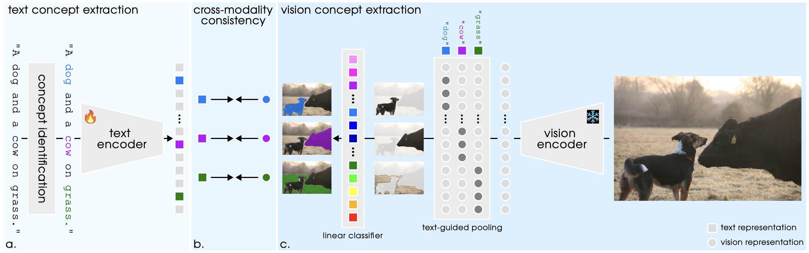

# SimZSS

[[`OpenReview`](https://openreview.net/forum?id=QzPKSUUcud)]

This repo contains the Pytorch implementation of our ICLR 2025 paper:
> [**A Simple Framework for Open-Vocabulary Zero-Shot Segmentation**](https://openreview.net/forum?id=QzPKSUUcud)
>
>[Thomas Stegmüller*](https://people.epfl.ch/thomas.stegmuller?lang=en), [Tim Lebailly*](https://www.timlebailly.com/)
> , [Nikola Dukic](https://scholar.google.com/citations?user=8OXlRdAAAAAJ&hl=en)
> , [Behzad Bozorgtabar](https://behzadbozorgtabar.com/), [Tinne Tuytelaars](https://homes.esat.kuleuven.be/~tuytelaa/)
> and [Jean-Philippe Thiran](https://people.epfl.ch/jean-philippe.thiran).



## Dependencies

```
pip install -r requirements.txt
python -m spacy download en_core_web_trf
```

## General

The classes of interest in the codebase are `SimZSS` in [model.py](src/open_clip/model.py) and `ZSLoss`
in [loss.py](src/open_clip/loss.py). The model config can be
found [here](src/open_clip/model_configs/ours_dinov2_ViT-B-14_reg.json). If you wish to use the denoiser, you need to
download the [weights](https://huggingface.co/jjiaweiyang/DVT) and set `checkpoint_path` to the correct location.

## Dataset preparation

We rely on img2dataset to download data shards in webdataset format. Below is an example using mscoco but more examples
can be found at the following [link](https://github.com/rom1504/img2dataset/tree/main/dataset_examples).

### (a) Download raw data

```
# Create data directory
mkdir data && cd data

# Fetch metadata
wget https://huggingface.co/datasets/ChristophSchuhmann/MS_COCO_2017_URL_TEXT/resolve/main/mscoco.parquet

# Use img2dataset to download
img2dataset --url_list mscoco.parquet --input_format "parquet"\
         --url_col "URL" --caption_col "TEXT" --output_format webdataset\
           --output_folder mscoco --processes_count 16 --thread_count 64 --image_size 512\
             --enable_wandb True --resize_mode center_crop
```

### (b) Post processing

For efficient GPU training, we post process shards to include POS tagging information for each caption. We process one
shard for each rank we have available using SLURM. Set `--base_raw` to the location where you downloaded the dataset in
step (a). Set `--base_processed` to a new location to store the processed dataset.

```
#!/bin/bash
#SBATCH --job-name=process_shards
#SBATCH --account=<account>
#SBATCH --cpus-per-task=1
#SBATCH --exclusive
#SBATCH --mem=448GB
#SBATCH --ntasks-per-node=56
#SBATCH --nodes=1
#SBATCH --open-mode=append
#SBATCH --partition=<partition>
#SBATCH --time=180
#SBATCH --output=</some/path/%j_0_log.out>
#SBATCH --error=</some/path/%j_0_log.err>

cd src/training
srun python make_shards_spacy.py --base_raw data/mscoco --base_processed data/mscoco_processed
```

To save space, you can delete `base_raw`.

## Training

### Download pretrained denoiser

See [https://github.com/huggingface/pytorch-image-models](https://github.com/huggingface/pytorch-image-models)

```
wget https://huggingface.co/jjiaweiyang/DVT/resolve/main/voc_denoised/vit_base_patch14_reg4_dinov2.lvd142m.pth
```

and set `vision_cfg.checkpoint_path` to that location in
the [model config](src/open_clip/model_configs/ours_dinov2_ViT-B-14_reg.json).

### Running

The main file can be run as follows:

```
python -u src/training/main.py
```

An example of a slurm script can be found below:

```
#!/bin/bash
#SBATCH --job-name=simzss
#SBATCH --account=<account>
#SBATCH --cpus-per-task=7
#SBATCH --exclusive
#SBATCH --gpus-per-node=8
#SBATCH --mem=448GB
#SBATCH --nodes=2
#SBATCH --ntasks-per-node=8
#SBATCH --open-mode=append
#SBATCH --partition=<partition>
#SBATCH --signal=USR2@120
#SBATCH --time=1440
#SBATCH --output=%j_0_log.out
#SBATCH --error=%j_0_log.err

master_addr=$(scontrol show hostnames "$SLURM_JOB_NODELIST" | head -n 1)
export MASTER_ADDR=$master_addr
export MASTER_PORT=12802

export PYTHONPATH="$PYTHONPATH:$PWD/src"
srun --unbuffered --output %j_%t_log.out --error %j_%t_log.err \
python -u src/training/main.py \
    --name simzss \
    --train-data "/some/path/mscoco_processed/{00000..00295}.tar" \
    --epochs 10 \
    --model ours_dinov2_ViT-B-14_reg \
    --denoiser_type transformer \
    --image_features_type cls \
    --batch-size 1024 \
    --train-num-samples 400000 \
    --wandb_mode online \
    --warmup 0.1 \
    --lr 3e-5 \
    --save-frequency 2 \
    --decoder_softmax_dim patch \
    --temp_decoder 0.1 \
    --decoder_type shallow \
    --nouns_path src/training/class_names/7_dataset_eval_merged.txt \
    --indices_type concept \
    --lambda_loss 0.05 \
    --n_dense_cls 1 \
    --lock-image \
    --pretrained-image \
    --save-most-recent \
    --gather-with-grad \
    --local-loss \
```

## Pretrained model

Two ViT-B/14 checkpoints trained on COCO Captions and LAION-400M can be found at
this [link](https://1drv.ms/f/c/dab53052714a2245/EkcYZFFH4EtEi69qaBRnExsBBPIt2_SG8s9jsOMraU9cEA?e=ko1fkt). Loading the
checkpoints can be done as follows:

```python
import torch
import json
from argparse import Namespace
import sys

sys.path.insert(0, 'src')
from open_clip.factory import create_model

with open("args_coco.json", "r") as f:
    args = Namespace(**json.load(f))

model = create_model(
    args.model,
    args.pretrained,
    precision=args.precision,
    device='cpu',
    jit=args.torchscript,
    force_quick_gelu=args.force_quick_gelu,
    force_custom_text=args.force_custom_text,
    force_patch_dropout=args.force_patch_dropout,
    force_image_size=args.force_image_size,
    pretrained_image=args.pretrained_image,
    args=args
)

state_dict = torch.load('<checkpoint>', map_location='cpu', weights_only=False)
state_dict = {k.replace("module.", ""): v for k, v in state_dict.items()}
model.load_state_dict(state_dict)

# Text encoder
model.text

# Vision encoder
model.visual
```

## Citation

If you find our work useful, please consider citing:

```
@inproceedings{
stegmuller2025a,
title={A Simple Framework for Open-Vocabulary Zero-Shot Segmentation},
author={Thomas Stegm{\"u}ller and Tim Lebailly and Nikola {\DJ}uki{\'c} and Behzad Bozorgtabar and Tinne Tuytelaars and Jean-Philippe Thiran},
booktitle={The Thirteenth International Conference on Learning Representations},
year={2025},
url={https://openreview.net/forum?id=QzPKSUUcud}
}
```

## Acknowledgments

This code is adapted from [OpenCLIP](https://github.com/mlfoundations/open_clip).